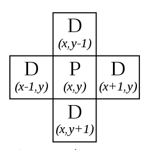
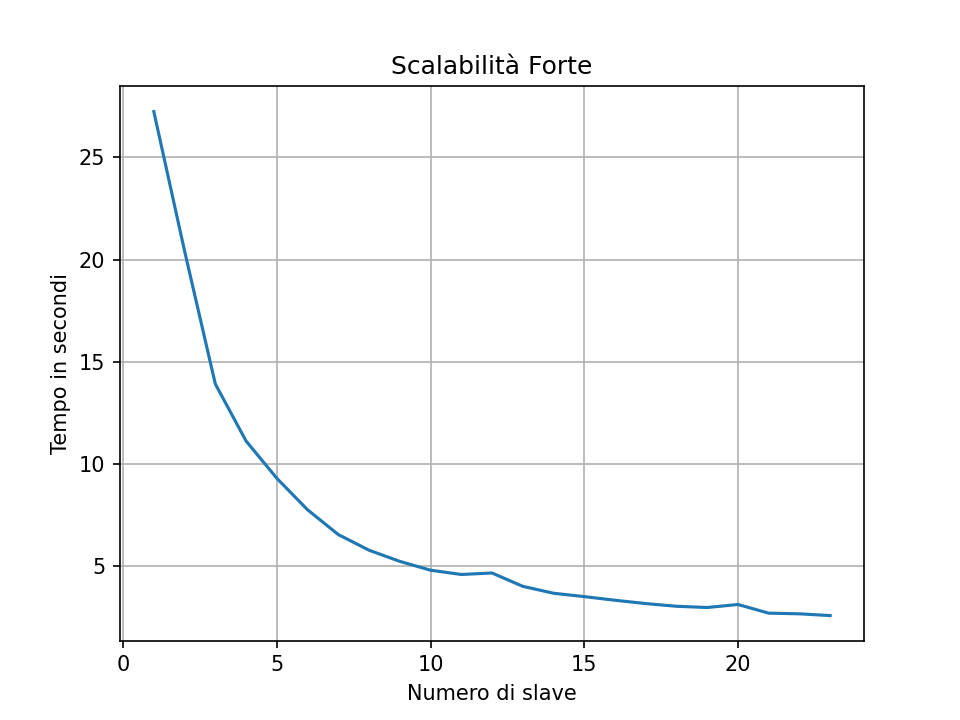
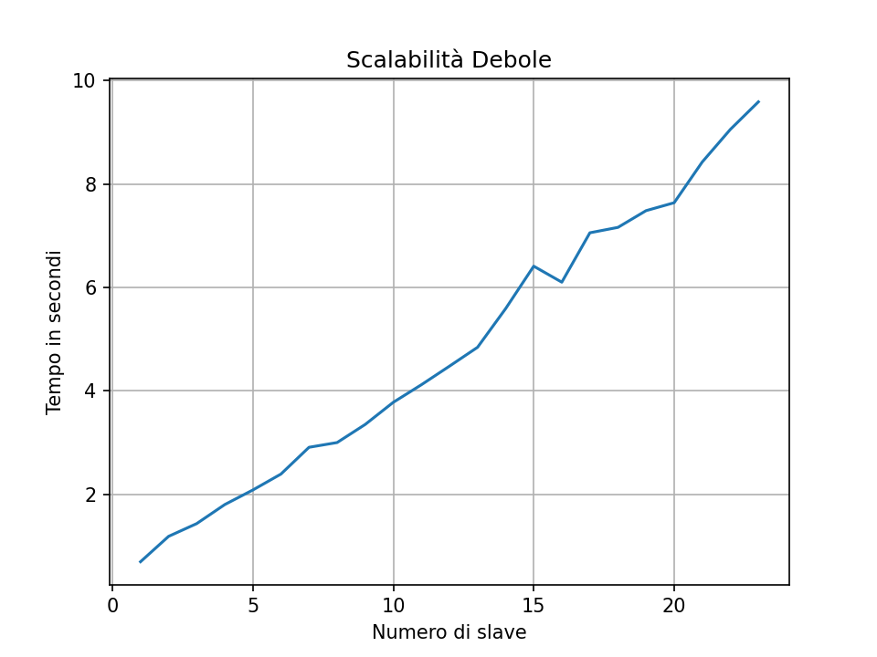

# Forest-Fire-Simulation
## Introduction
The [Forest-Fire-Model](https://en.wikipedia.org/wiki/Forest-fire_model) is a [cellular automata](https://en.wikipedia.org/wiki/Cellular_automaton) model defined through an NxN matrix.

Each cell of the matrix used in this model can assume the following states:
* __TREE__
* __EMPTY__
* __BURNING_TREE__

The states are represented within the project through these symbols:

|ASCII Charachter | Stato | Emoji |
|------------------|------|-------|
|1|TREE|🌲|
|2|EMPTY|🚫|
|3|BURNING_TREE|🔥|

The model is defined by 4 fundamental rules:
1. A burning cell(__BURNING_TREE__) turns into an empty cell(__EMPTY__)
2. A tree(__TREE__) will go up in flames if at least one neighbor is on fire(__BURNING_TREE__).
3. A tree(__TREE__) will go up in flames with a probability __*f*__ even if there are no neighbors on fire(__BURNING_TREE__).
4. In an empty cell(__EMPTY__) a tree will gorw(__TREE__) with probability __*p*__.

### The concept of proximity used   

>__Neighborhood of Von Neumann__
>
>In cellular automata, the von Neumann neighborhood (or 4 neighborhoods) is classically defined on a two-dimensional square lattice and is composed of a central cell and its four adjacent cells. The neighborhood is named after John von Neumann, who used it to define the von Neumann cellular automaton.
>
> <p align="center">  </p>

## Environment Configuration and Execution
### Prerequisites
* Ubuntu 18.04 LTS
* Docker
A Docker container was used to configure the development environment, this docker container was created from:
```
docker run -it --mount src="$(pwd)",target=/home,type=bind spagnuolocarmine/docker-mpi:latest
```

To execute, change to the directory to

```
cd /home/Forest-Fire-SImulation/src/
```

compile using the command
```
mpicc main.c -o main.out
```
and executes using the command below, entering the values without quotes:
* np = Number of process
* N = Matrix dimension
* I = Number of iteration

```
mpirun --allow-run-as-root -np "np" main.out "N" "I"
```

The required execution environment, and therefore of measurement, involved the creation of a homogeneous Cluster made up of N machines.               
[GCP(Google Cloud Platform)](https://cloud.google.com) was used for the cluster creation composed by 6 machine __e2-standard-4(4 vCPU, 16GB of Memory)__.    

The cluster configuration was done using the following guide       `https://github.com/spagnuolocarmine/ubuntu-openmpi-openmp`
## Proposed solution
The algorithm was implemented through the C language and the [OpenMPI](https://www.open-mpi.org/doc/) library, an implementation of the standard [MPI(Message Passing Interface)](https://it.wikipedia.org/wiki/Message_Passing_Interface#Implementazioni)

The algorithm takes N and I as input, respectively:
* N - Dimension of the Matrix NxN
* I - Number of iteration of the algorithm over the forest.

The master process takes care of the generation of an NxN matrix that represents our forest, the work that is up to each slave process is then calculated and the portion of the matrix to be analyzed is sent to it.    

Subsequently, each process asynchronously sends its portion to be analyzed to the neighbors and will then receive their part from the other processes.    

Each process (slave) during the asynchronous communication phase begins to analyze the portion of the matrix assigned to it, independent of the neighbors, once the elements are received from the neighbors, the rules involving the control of the neighbors are applied and subsequently, once the iterations are finished, they are sent to the master sends the updated portion to the master.         

## Analysis of the code
Let's look at the code associated with generating the forest.   
```c
    //main.c
    
    char *forest = malloc(sizeof *forest * N * N); //Starter Forest Matrix
    char *temp = malloc(sizeof *forest * N * N); //Temp Matrix
    
    if(my_rank == 0){
        srand(42);//Random Seed
        generation(N,&forest);
    }
```

```c
//myforest.h

#define F 10 //100    //Ignite probability F(Fire)
#define P 70 //100       //New Tree probability

#define TREE "🌲"
#define BURNING_TREE "🔥"
#define EMPTY "🚫"

// 1(TREE) 2(EMPTY) 3(BURNING TREE)

void generation(int N, char **matrix){
    srand(42);
    for(int i=0; i < N; i++){
        for(int j =0; j < N; j++){
            int randValue = (rand() % 101);
            if(randValue <= F){
                (*matrix)[(i*N)+j] = '3';
            }else if(randValue > F && randValue <= P){
                (*matrix)[(i*N)+j] = '1';
            }else{
                (*matrix)[(i*N)+j] = '2';
            }
        }
    }
}

```
Then it is necessary to divide the work between the slave processes and send them the portions of the forest to work on.      

```c
    //main_2.c
    
    //Calculating the number of elements for each process
    int* sendCount = malloc ( size_p* sizeof(int));
    int* displacement = malloc(size_p * sizeof(int));
```

```c
    //main_2.c
    divWork2(N,size_p,&sendCount,&displacement);
    char *recvBuff;
    if(my_rank == 1 || my_rank == (size_p-1)){
        recvBuff = (char*) calloc(sendCount[my_rank]+N,sizeof(char));
    }else{
        recvBuff = (char*) calloc(sendCount[my_rank]+(2*N),sizeof(char));
    }

    if(my_rank == 1){
        MPI_Scatterv(forest,sendCount,displacement,MPI_CHAR,recvBuff,sendCount[my_rank],MPI_CHAR,0,MPI_COMM_WORLD);
    }else{
        MPI_Scatterv(forest,sendCount,displacement,MPI_CHAR,(recvBuff+N),sendCount[my_rank],MPI_CHAR,0,MPI_COMM_WORLD);
    }
```

```c
//myforest.h

void divWork2(int N, int size, int** sendCount, int** displacement){
    int numberOfRow = N / (size - 1);
    int restVal = N % (size - 1);

    int pos = 0;
    (*displacement)[0] = 0;
    (*sendCount)[0] = 0; //Al processo master non dò nulla da fare.

    for(int i = 1; i < size;i++){
        (*sendCount)[i] = (numberOfRow*N);
        if(restVal > 0){
            (*sendCount)[i] += N;
            restVal--;
        }
        //Calcolo il displacement per la scatterv
        (*displacement)[i] = pos;
        pos = pos + (*sendCount)[i];
        //printf("Displ[%d]:%d \n",i,(*displacement)[i]);
        //printf("SendCount[%d]: %d \n ",i,(*sendCount)[i]);
    }
}
```
Each slave process will send its own portion of the matrix to its neighbours and receive it from the other processes.
```c
        //main_2.c
            
        if( my_rank != 0){
            if(prec != -10){
                //Ricevo dal precedente
                MPI_Irecv(recvBuff,N,MPI_CHAR,prec,TAG,MPI_COMM_WORLD,&req1);
            }
            //Ricevo dal successivo
            if(dest != -10){
                if(my_rank == 1){
                    MPI_Irecv((recvBuff+sendCount[my_rank]),N,MPI_CHAR,dest,TAG,MPI_COMM_WORLD,&req2);
                }else{
                    MPI_Irecv((recvBuff+N+sendCount[my_rank]),N,MPI_CHAR,dest,TAG,MPI_COMM_WORLD,&req2);
                }
            }
            //Sending to the previous
            if(prec != -10){
                MPI_Isend((recvBuff+N),N,MPI_CHAR,prec,TAG,MPI_COMM_WORLD,&req);
            }
            if(dest != -10){
                //Sending to next
                if(my_rank == 1){
                    MPI_Isend((recvBuff+sendCount[my_rank])-N,N,MPI_CHAR,dest,TAG,MPI_COMM_WORLD,&req);
                }else{
                    MPI_Isend((recvBuff+N+sendCount[my_rank])-N,N,MPI_CHAR,dest,TAG,MPI_COMM_WORLD,&req);
                }
            }
```

We then start analysing the portion of the matrix that already holds the process while waiting for the elements of the neighbouring.
```c
    //main_2.c
    
    //Working on my elements
    int start = my_rank == 1 ? 0 : 1;
    int end = my_rank == 1 ? sendCount[my_rank] : sendCount[my_rank] + N;

    checkMine(recvBuff,temp,start,end,my_rank,prec,dest, N); //flag a 0 check senza vicini

    MPI_Wait(&req1,&Stat1);
    MPI_Wait(&req2,&Stat2);
   
```

```c
//myforest.h
void checkMine(char* recvBuff, char* temp, int start, int end, int rank, int prec, int dest,int N){
    for(int i = start; i < end/N; i++){
        for(int j = 0; j < N; j++){
                if(recvBuff[(i*N)+j] == '2'){ // 4) An empty space fills with a tree with probability p
                    if((rand() % 101) <= P ){
                        temp[(i*N)+j] = '1';
                    }else{
                        temp[(i*N)+j] = '2';
                    }
                }else if(recvBuff[(i*N)+j] == '3') { //1) A burning cell turns into an empty cell
                    temp[(i*N)+j] = '2';
                }
        }
    }
}
```

Next, the neighbours of the elements must be analysed to determine the spread of the flames.        

```c
//main.c

            for(int i = start; i < end/N; i++){
                for(int j = 0; j < N; j++){
                    if(recvBuff[(i*N)+j] == '1'){
                        burningTree(temp,recvBuff,start,end,i, j, N);
                        //2) A tree will burn if at least one neighbor is burning
                        //3) A tree ignites with probability f even if no neighbor is burning
                    }
                }
            }
```
This is done by sending/receiving neighbours, within a loop that iterates over I, and finally a swap of pointers is performed to continue working in subsequent iterations to the updated portion of the matrix.         

```c
//main.c

        char* suppPointer;
        suppPointer = recvBuff;
        recvBuff = temp;
        temp = suppPointer;
```


Once the iterations are complete, the updated portions of the matrix from each slave process are sent to the master process.

```c
//main.c

    if(my_rank == 1){
        MPI_Gatherv(recvBuff,sendCount[my_rank],MPI_CHAR,forest,sendCount,displacement,MPI_CHAR,0,MPI_COMM_WORLD);
    }else{
        MPI_Gatherv(recvBuff+N,sendCount[my_rank],MPI_CHAR,forest,sendCount,displacement,MPI_CHAR,0,MPI_COMM_WORLD);
    }
```
## Correctness of the solution
The correctness of the algorithm was tested by setting the values of __P__ and __F__ to __100__ .    

```c
//myforest.h

#define TAG 42
#define F 100     //Ignite probability F(Fire)
#define P 100       //New Tree probability

#define TREE "🌲"
#define BURNING_TREE "🔥"
#define EMPTY "🚫"
```
A new function was written for the initialisation of the matrix, which instead of random values uses the modulus of the for index to generate the matrix.
Then the algorithm was run using a fixed number for the input and varying the number of processes, so it was possible to observe that the output matrix was always the same, thus proving the correctness of the algorithm.    

```c
//main.c

    if(my_rank == 0){
        srand(42);//Random Seed
        generationDeterministic(N,&forest);
    }
```

```c
//myforest.h

void generationDeterministic(int N, char **matrix){
    for(int i = 0; i < N; i++){
        for(int j = 0; j < N; j++){
            if((i % 3) == 0){
                (*matrix)[(i*N)+j] = '1'; //TREE
            }else if((i % 3) == 1){
                (*matrix)[(i*N)+j] = '2'; //EMPTY
            }else{
                (*matrix)[(i*N)+j] = '3'; //BURNING TREE
            }
        }
    }
}
```


## Benchmark
Shown below are the measurements made using the Homogeneous Cluster [already described](#configurazione-ambiente-ed-esecuzione) .        

Measurements have been taken to obtain:
* __Strong Scalability__
* __Weak Scalability__

### Strong Scalability
Strong scalability was achieved by analysing multiple executions of the algorithm, using the configured cluster, increasing the number of processes at each execution, thus using from 2 vCPU to 24 vCPU.   

The input used to perform the analysis was:
* N = 5000
* I = 50

|Number of Processes|Time(s)    |Speedup|
|:----------------:|:----------:|:-----:|
|1                 |27.242525   | 1.00  |
|2                 |20.424715   | 1.33  |
|3                 |13.919035   | 1.95  |
|4                 |11.126861   | 2.44  |
|5                 |9.303328    | 2.92  |
|6                 |7.762574    | 3.51  |
|7                 |6.550036    | 4.15  |
|8                 |5.783624    | 4.71  |
|9                 |5.238248    | 5.20  |
|10                |4.806311    | 5.67  |
|11                |4.596453    | 5.93  |
|12                |4.669662    | 5.84  |
|13                |4.017718    | 6.79  |
|14                |3.678917    | 7.42  |
|15                |3.514501    | 7.76  |
|16                |3.336226    | 8.18  |
|17                |3.172971    | 8.59  |
|18                |3.041431    | 8.96  |
|19                |2.980639    | 9.14  |
|20                |3.128735    | 8.73  |
|21                |2.704358    | 10.08 |
|22                |2.671802    | 10.20 |
|23                |2.584825    | 10.55 |


### Weak Scalability
Weak scalability was also achieved by analysing multiple executions of the algorithm on the cluster.

The input used to perform the analysis was:
* N = 400*np
* I = 50

|Numero of Processes|Time(s)    |Input Dimension(N)|Input Dimension(I)|
|:----------------:|:----------:|:-----------------:|:-----------------:|
|1                 |0.698966    | 400x400           |50                 |   
|2                 |1.189706    | 800x800           |50                 |
|3                 |1.436100    | 1200x1200         |50                 |
|4                 |1.804403    | 1600x1600         |50                 |
|5                 |2.086154    | 2000x2000         |50                 |
|6                 |2.394085    | 2400x2400         |50                 |
|7                 |2.911704    | 2800x2800         |50                 |
|8                 |3.003367    | 3200x3200         |50                 |
|9                 |3.353309    | 3600x3600         |50                 |
|10                |3.781323    | 4000x4000         |50                 |
|11                |4.120756    | 4400x4400         |50                 |
|12                |4.480034    | 4800x4800         |50                 |
|13                |4.845016    | 5200x5200         |50                 |
|14                |5.592357    | 5600x5600         |50                 |
|15                |6.413034    | 6000x6000         |50                 |
|16                |6.103976    | 6400x6400         |50                 |
|17                |7.058765    | 6800x6800         |50                 |
|18                |7.163511    | 7200x7200         |50                 |
|19                |7.486568    | 7600x7600         |50                 |
|20                |7.639772    | 8000x8000         |50                 |
|21                |8.427413    | 8400x8400         |50                 |
|22                |9.056979    | 8800x8800         |50                 |
|23                |9.590614    | 9200x9200         |50                 |



## Conclusions

Analysing the benchmarks and specifically the results obtained in terms of strong scalability and weak scalability, we can see that the introduction of parallelism has brought a considerable advantage, which can be observed by analysing the speedup, obviously taking into account the overhead introduced by the communication between processes, and the latency introduced by the use of a cluster.    
